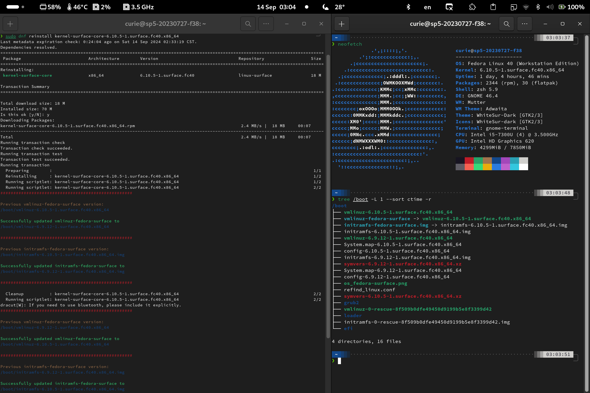

# fedora-boot-symlink-script
This script will generate a relative symbolic link with unified name to the latest kernel and initramfs. Since **Fedora** has version number under those files, that makes it difficult for `rEFInd` or `systemd-boot` to manually make a menuentry.



- The script will automatically run when `kernel-core` is installed or updated.
- By default, the script only recognised official kernel.
- For variants (zen, xanmod, surface etc.), you need to edit the script and uncomment the variants section and change `KERNEL_VARIANT="surface"` to adapt your kernel version.
- The run result will printed on the terminal when running `scriptlet` for `kernel-core`

- your latest kernel `vmlinuz-$(uname -r)` will be linked as **`vmlinuz-fedora`**, whereas `initramfs-$(uname -r).img` will be **`initramfs-fedora.img`**
## Installation

`cd /tmp`

`git clone https://github.com/Ramen-LadyHKG/fedora-boot-symlink-script.git`

`cd fedora-boot-symlink-script`

`sudo cp "98-create-vmlinuz-symlink.install" "/etc/kernel/install.d/98-create-vmlinuz-symlink.install"`

**OPTIONAL**: adjust the filename number to adapt your `/etc/kernel/install.d/**` scripts run sequence.
**OPTIONAL**: For variants (zen, xanmod, surface etc.), you need to edit the script and uncomment the variants section and change `KERNEL_VARIANT="surface"` to adapt your kernel version.


### rEFInd

- you need to enable `follow_symlinks true` in `/boot/efi/EFI/refind/refind.conf`


for reference
```conf
# Support symlinks(relative path only)
# (支援symlinks [但絕對路徑不能用])
follow_symlinks true


##########################################################
### Manual Menuentry (手動開機選單)
##########################################################

############# ARCH LINUX
#

############# Fedora Linux
#
menuentry "Fedora Linux (linux)" {
	volume   8b704162-eec3-48e1-b824-c3638d87cf65
	ostype	 Linux
	loader "vmlinuz-fedora-surface"
	initrd "initramfs-fedora-surface.img"
    	icon     /os_fedora-surface.png
    	#icon     /EFI/refind/themes/rEFInd-Haruhi/icons(rEFInd-Haruhi)/os_fedora-surface.png
	options  "root=UUID=9662ead3-d507-4dbd-a64c-a0f4188f11c2 ro rootflags=subvol=@ rd.luks.uuid=luks-2a537c3f-1bc7-4eb1-9760-9c0a14b2f4f2 rhgb quiet"

	submenuentry "(Regular)" {
		loader	vmlinuz-feodra
		initrd	initramfs-fedora.img
		icon	os_feodra.png
		disabled
	}
	submenuentry "(Surface) Boot using fallback initramfs (Surface)" {
		loader	vmlinuz-0-rescue-8f509b0dfe49450d9199b5e8f3399d42
		initrd	initramfs-0-rescue-8f509b0dfe49450d9199b5e8f3399d42.img
	}
   	submenuentry "(Surface) Boot to terminal" {
	        add_options "systemd.unit=multi-user.target"
	}
	submenuentry "(Regular) Boot to terminal" {
		loader	vmlinuz-fedora
		initrd	initramfs-fedora.img
	        add_options "systemd.unit=multi-user.target"
		disabled
	}
	submenuentry "(Old) Kernel" {
		loader vmlinuz-6.9.12-1.surface.fc40.x86_64
		initrd initramfs-6.9.12-1.surface.fc40.x86_64.img
	}	
}
```
